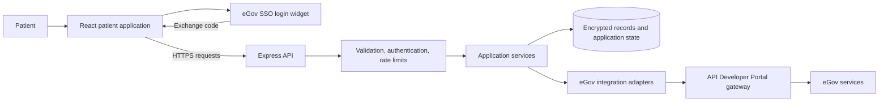
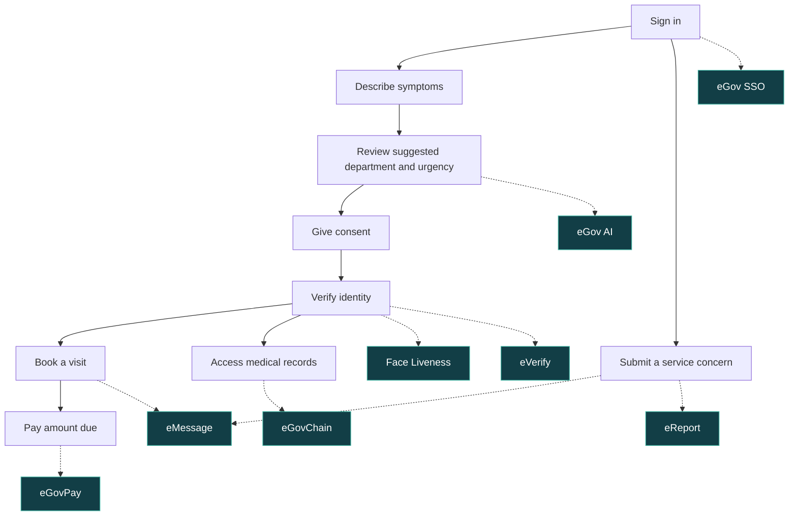

<p align="center">
  
</p>

# eGovMed

**The smart front door to public healthcare.**

Patients often repeat the same information at registration, consultation, laboratory, and payment counters. eGovMed brings those steps into one patient journey: sign in, describe symptoms, verify identity, book a visit, pay, and access medical records.

Built by **Bisaya-Hackers**, a **Top 30 team in eGov Hackathon 2026**. The prototype is designed around a proposed Philippine General Hospital (PGH) pilot.

**[Local setup](#run-locally) · [Architecture](docs/architecture.md) · [API integrations](docs/integrations.md) · [Security](docs/security.md)**

## System architecture

The patient app talks to one backend, which handles validation, patient access, storage, and the government service adapters.



## Try the application

1. Follow the local setup below and open **http://localhost:3000**.
2. In local mock mode, enter any six digits in the sign-in screen to load a demonstration patient.
3. Choose **Start a visit** and enter fictional symptoms to see the suggested department and urgency.
4. Explore Records, Payments, Messages, and Report from the patient home screen. Identity, payment, and messaging steps are simulated locally.

The shared source defaults to mock integrations and requires no government API calls. Reviewers can run the complete local demonstration without using the team's service allowance. Live integration requires the reviewer's own credentials and an explicit configuration change.

## Patient journey

Solid arrows show the patient journey. Dotted arrows show the government service used at each step.



- **One sign-in:** eGov SSO supplies the patient profile and establishes a session.
- **Guided routing:** eGov AI interprets symptoms in English, Tagalog, or Taglish and suggests a specialty and urgency. A rule-based safety floor prevents the model from lowering recognized urgent or emergency signals.
- **Verified access:** Face Liveness and eVerify support consent-based identity checks before medical record access.
- **Appointments and messages:** patients select a department and slot, receive a queue reference, and get confirmation messages.
- **Payments:** eGovPay provides hosted checkout. The prototype applies configured benefit and discount rules before calculating the amount due.
- **Portable records:** medical content is encrypted off-chain; eGovChain stores record fingerprints for tamper detection.
- **Service concerns:** eReport receives complaints after a one-time-code check. eGovMed retains the case number and its own local follow-up state.

## eGov API integration

The backend contains live and mock adapters for eight services:

| Service | Role in eGovMed | Implementation |
| --- | --- | --- |
| eGov SSO | Sign-in and patient profile | [egovph.js](backend/src/integrations/egovph.js) |
| eGov AI | Symptom triage and record summaries | [egovAi.js](backend/src/integrations/egovAi.js) |
| eVerify | PhilSys demographic verification | [identity.js](backend/src/integrations/identity.js) |
| Face Liveness | Live-person verification | [identity.js](backend/src/integrations/identity.js) |
| eMessage | Notifications and one-time codes | [eMessage.js](backend/src/integrations/eMessage.js) |
| eGovPay | Hosted payment checkout | [egovPay.js](backend/src/integrations/egovPay.js) |
| eGovChain | Record fingerprint anchoring and verification | [egovChain.js](backend/src/integrations/egovChain.js) |
| eReport | Complaint submission | [eReport.js](backend/src/integrations/eReport.js) |

See [integration details](docs/integrations.md) for gateway URLs, authentication, and service-specific behavior.

## Dependencies and environment

The manifests list the direct dependencies below. Each package includes a lockfile for reproducible installation with `npm ci`.

- **Backend runtime**
  - `@upstash/redis` (^1.34.0)
  - `cors` (^2.8.5)
  - `dotenv` (^16.4.5)
  - `ethers` (^6.13.2)
  - `express` (^4.19.2)
  - `jsonwebtoken` (^9.0.2)
  - `morgan` (^1.10.0)
  - `zod` (^3.23.8)
- **Frontend runtime**
  - `@gsap/react` (^2.1.1)
  - `gsap` (^3.12.5)
  - `react` (^18.3.1)
  - `react-dom` (^18.3.1)
  - `reicon-react` (^1.1.0)
- **Frontend build tools**
  - `@vitejs/plugin-react` (^4.3.1)
  - `vite` (^6.4.3)

Start with [backend/.env.example](backend/.env.example) and [frontend/.env.example](frontend/.env.example). Both are configured for local evaluation. The [configuration guide](docs/configuration.md) explains storage, secrets, per-service modes, and using your own live credentials.

## Run locally

Use **Node.js 24** and npm. Dependencies are pinned in each package's lockfile.

```bash
git clone https://github.com/M4tyu633/egovmed-showcase.git
cd egovmed-showcase/backend
npm ci
node -e "require('fs').copyFileSync('.env.example', '.env')"
npm run dev
```

In a second terminal:

```bash
cd egovmed-showcase/frontend
npm ci
node -e "require('fs').copyFileSync('.env.example', '.env')"
npm run dev
```

Open **http://localhost:3000**. The backend listens on port **4000**, and Vite proxies `/api` to it. The default configuration uses in-memory storage and mock integrations, so no eGov credentials or credits are needed. Local data is temporary and disappears when the backend stops.

The example secrets are for local evaluation only. See [configuration](docs/configuration.md) to generate persistent secrets or enable a live service.

## Project structure

```text
frontend/                 React patient application
  src/screens/            Patient journey screens
  src/components/         Shared interface components
  src/i18n/               English and Tagalog content
  src/lib/                API client and provider SDK loaders
backend/                  Express API
  src/routes/             Request validation and HTTP endpoints
  src/services/           Patient workflow and business logic
  src/integrations/       eGov service adapters
  src/store/              In-memory and Upstash Redis storage
  test/                   Backend regression tests
docs/                     Architecture, configuration, integrations, security
```

**Stack:** React 18, Vite, GSAP, Node.js, Express, Zod, Upstash Redis, ethers, and Hyperledger Besu through eGovChain. This repository is an independent source review copy with automatic deployments disabled.

## Validation

```bash
cd backend
npm test
```

```bash
cd frontend
npm run build
```

Tests use mock integrations and isolated local fixtures. They cover authentication, patient isolation, encryption, liveness replay protection, report one-time codes, payment behavior, and triage safeguards. The included GitHub workflow runs only when manually requested and has no deployment step.

## Prototype scope

This is a hackathon prototype, not an operating hospital service or an official PGH deployment. Hospital schedules, queue behavior, sample records, and PhilHealth, White Card, and SSS benefits are demonstration data or application-level rules, not integrations with hospital or benefit-agency systems. AI triage supports assessment and does not provide a diagnosis. eGovMed's report status does not mirror the government's case-resolution queue.

Read [security and limitations](docs/security.md) for the implemented controls and remaining production work.

## Team

**Bisaya-Hackers:** Matthew Labrador, Clarence Pagaduan, Paul Recio, Harry Gomez, and Javier Mendoza.
