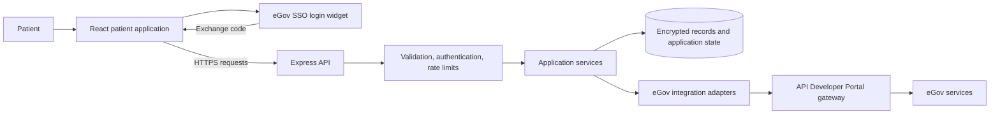
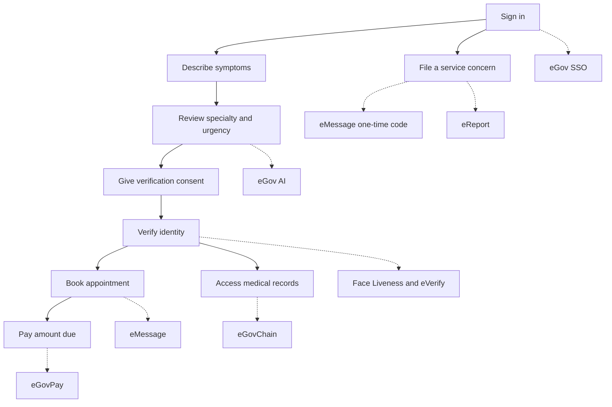
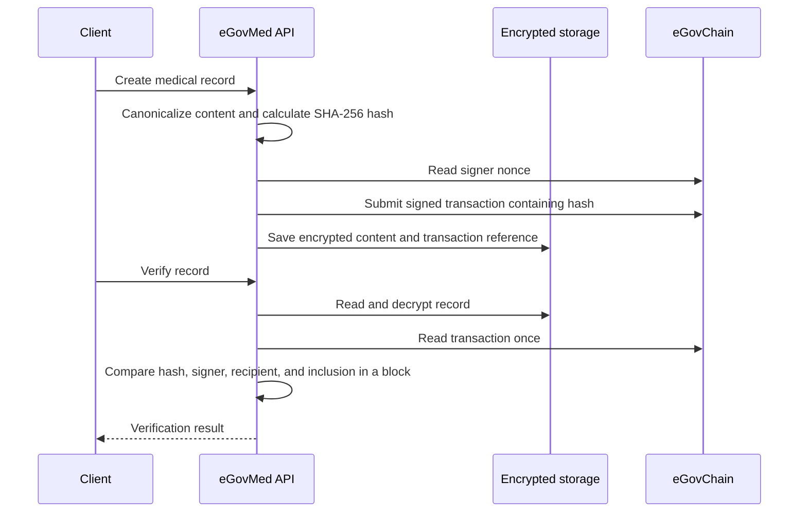

# Architecture

eGovMed separates the patient interface, application logic, storage, and government integrations. The Express API can support an additional client, such as an assisted kiosk, without duplicating business logic.

## System flow

The live backend stores sessions, records, consent receipts, notifications, and workflow state in Upstash Redis. Local evaluation uses the same storage interface with an in-memory implementation. The frontend receives public profile fields and a session JWT; government partner secrets remain on the backend.

## Patient journey and integration points

## Data boundaries

- **Browser:** interface state, public configuration, and a session-scoped application token. The SSO exchange code is consumed immediately.
- **Backend:** validates input, authorizes access to each patient's resources, applies workflow rules, and calls government services.
- **Storage:** clinical record payloads, symptom text, and complaint narratives are encrypted with AES-256-GCM. Operational fields needed for lookup remain separate from encrypted content.
- **Blockchain:** only a record fingerprint is placed in transaction calldata. Clinical text and patient identifiers are not written on-chain.
- **External services:** receive the data needed for the requested operation, such as demographics for identity matching or the destination number for an SMS.

## Record integrity

The current adapter uses signed transaction calldata and does not require a deployed application contract. Submission and verification are separate operations; a submitted transaction is not presented as confirmed. No background blockchain polling is used.

## Code organization

Routes in `backend/src/routes` handle HTTP concerns. Services in `backend/src/services` implement booking, payments, identity, records, and reports. Adapters in `backend/src/integrations` isolate each provider's protocol. Storage drivers implement a shared interface in `backend/src/store`.

The frontend's `App.jsx` coordinates screen state and backend actions. Screens render that state; shared components provide navigation, input, and overlays. English and Tagalog copy lives in `frontend/src/i18n/dict.js`.
