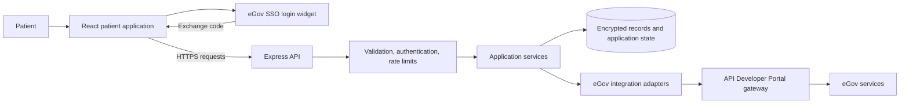
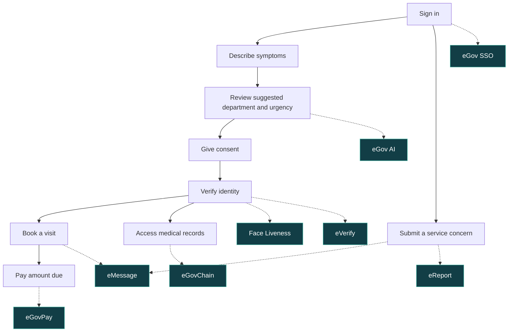
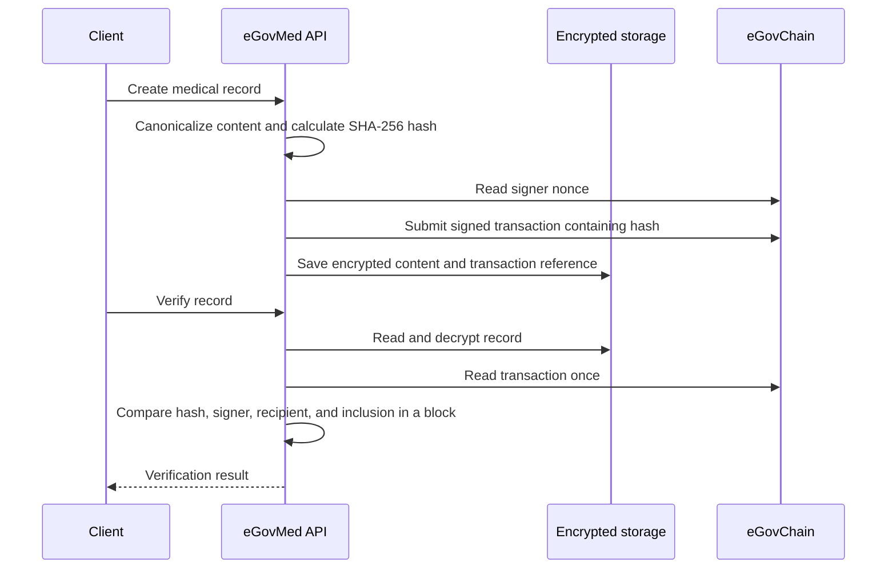

eGovMed brings the public-hospital patient journey into one app. Patients can describe symptoms, find a department, verify their identity, book a visit, pay, and access their medical records. The interface supports English and Tagalog, with symptom input in Taglish too.

Built by Bisaya-Hackers, a Top 30 team in eGov Hackathon 2026, the prototype is designed around a proposed Philippine General Hospital (PGH) pilot.

## System architecture

React handles the patient interface. The Express backend validates requests, checks patient access, stores encrypted medical content, and connects to the eGov APIs. Local evaluation uses mock adapters and temporary storage.

## Patient journey and eGov API integration

Solid arrows show the patient journey. Dotted arrows identify the service used at each step.

## How medical records are protected

Medical content stays encrypted off-chain. eGovChain stores a SHA-256 fingerprint, which can be compared with the stored record to detect changes. Submission and confirmation are separate steps.

## Source code and local evaluation

The public repository includes the application source, setup instructions, environment examples, architecture diagrams, API integration notes, and backend tests. It runs locally in mock mode by default, so reviewers do not need government API credentials or credits.

[View the public repository](https://github.com/M4tyu633/egovmed-showcase)

## Prototype scope

This is a hackathon prototype, not an official PGH deployment. Hospital schedules, queues, sample records, and benefit eligibility are demonstration workflows. AI triage suggests a next step and does not provide a diagnosis. Report tracking shows local follow-up status rather than the government's case-resolution status.
